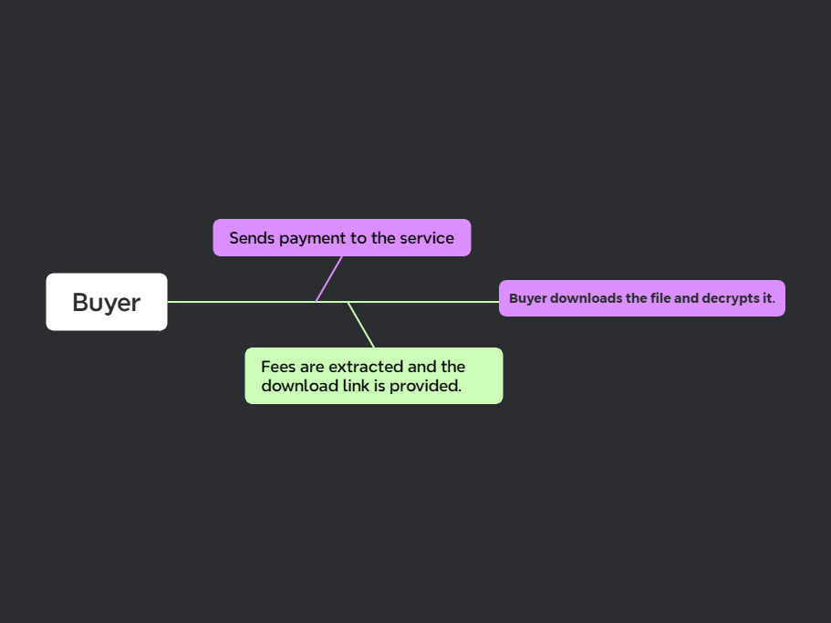

### Idea ([Goto Explore Index](./README.md))
This file is the initial idea for the project. It will be updated and maintained throughout the development process to represent the overall idea of the project.

#### Overview of the Idea
To create an End-to-End encrypted file sales platform that allows users to buy and sell files securely and privately, using the polygon blockchain.

#### Desired Interaction Flow
##### Seller Flow

The overall desired interaction with sellers (above) is the following:
1. The seller uploads files to the service.
	1. Fees are collected from the seller to cover storage fee's
2. Buyers purchase the file.
	1. Fees are collected from the sale to cover download fee's and provide profit to the service.
3. Seller receives funds to their crypto wallet.
4. Files are removed from the server after the product becomes inactive.

##### Buyer Flow

The overall interaction with buyers (above) is the following:
1. The buyer sends payment to the service.
	1. Fees are taken from this purchase.
2. File downloads are provided to the user.
3. The buyer decrypts the file with the decryption key provided by the seller.